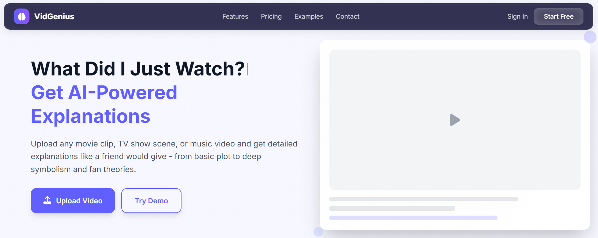
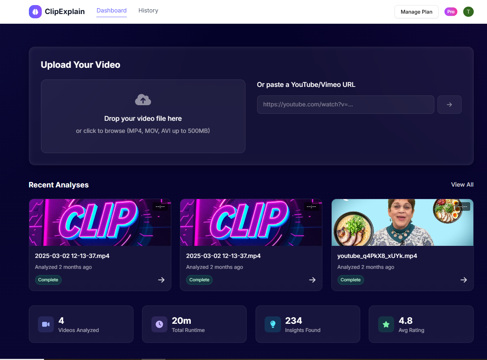
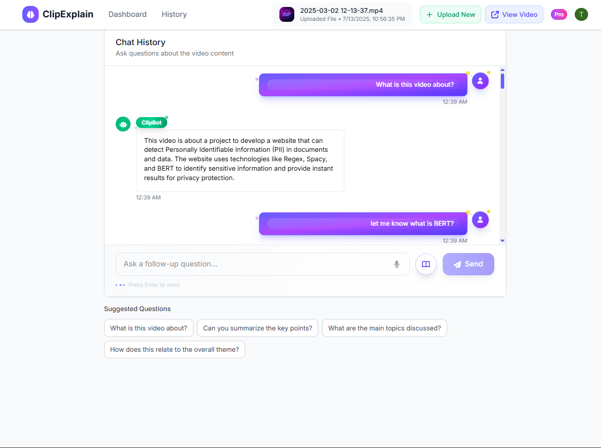
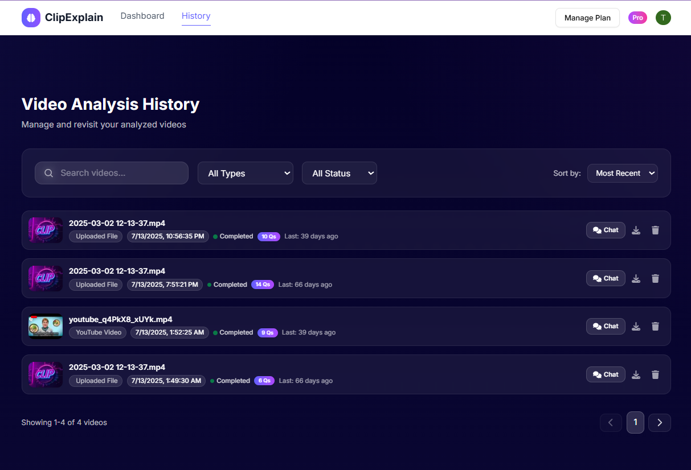
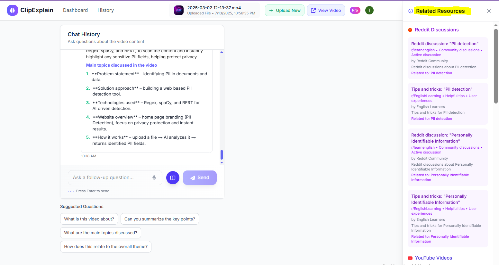
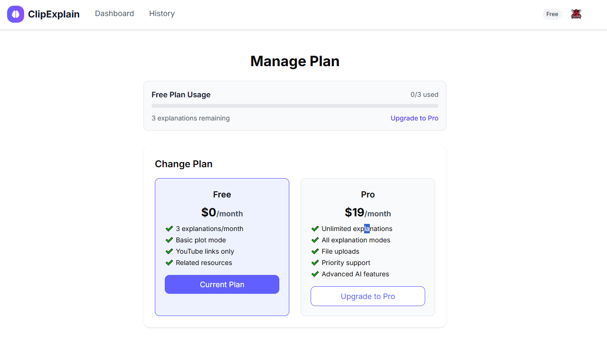
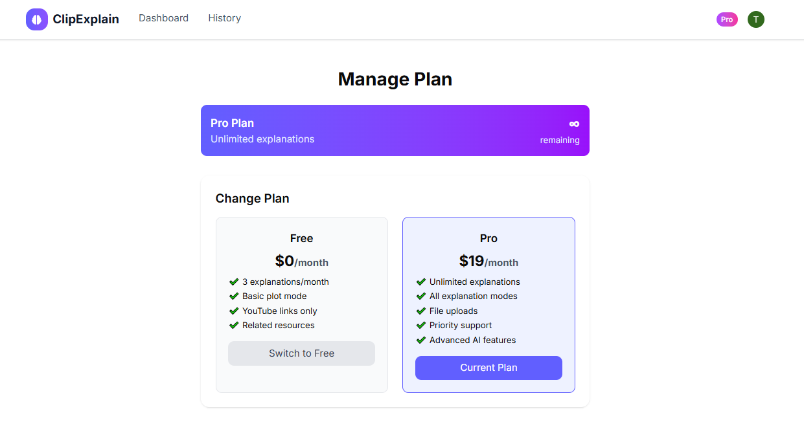
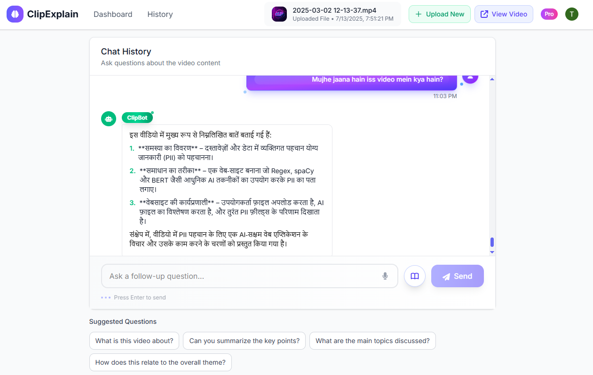

<div align="center">

**The Ultimate AI Video Whisperer**

*Transform any video into instant transcripts, smart summaries, and deep-dive explanations*

[](https://nextjs.org/)
[](https://reactjs.org/)
[](https://supabase.com/)
[](https://tailwindcss.com/)

</div>

---

VidGenius is an AI-powered SaaS platform that transforms any video into instant transcripts, smart summaries, and deep-dive explanations using advanced AI. Upload or paste a YouTube link, watch processing progress, then explore the content via an interactive chat. Built with Next.js App Router and a modern, responsive UI.

> ⚠️ **Development Status**: The project is in active development. Payment integration is not implemented yet and will be added soon.

## ✨ Features

<table>
<tr>
<td width="50%">

### 🎥 **Video Processing**
- **Upload & YouTube Support** - Process local uploads or YouTube URLs with real-time progress tracking
- **Automatic Transcription** - Server-side transcription pipeline with AssemblyAI integration
- **AI Explanations & Summaries** - Chunked transcript processing for comprehensive insights

</td>
<td width="50%">

### 💬 **Interactive Experience**
- **Chat with Your Video** - Ask questions and get grounded answers from video content
- **Keyword & Resource Generation** - Create searchable keywords and curated learning resources
- **History & Recent Analyses** - Quickly revisit previous videos and conversations

</td>
</tr>
<tr>
<td width="50%">

### 🎯 **User Management**
- **Usage Limits & Plans** - Free and Pro plan scaffolding with middleware-enforced limits
- **Real-time Notifications** - In-app toast notifications and confirmation modals
- **Secure Authentication** - NextAuth.js integration with multiple providers

</td>
<td width="50%">

### 🎨 **Modern Interface**
- **Responsive Design** - Mobile-first approach with Tailwind CSS
- **Intuitive Navigation** - Clean, modern UI components
- **Real-time Updates** - Live status updates and progress tracking

</td>
</tr>
</table>

## 🛠️ Tech Stack

<div align="center">

| Category | Technology |
|----------|------------|
| **Frontend** | Next.js 14, React 18, Tailwind CSS |
| **Backend** | Next.js API Routes, Server Actions |
| **Database** | Supabase (PostgreSQL + RLS) |
| **Authentication** | NextAuth.js |
| **AI/ML** | AssemblyAI, OpenAI/Gemini |
| **Background Jobs** | Inngest |
| **Deployment** | Vercel (recommended) |

</div>

### 📁 Project Structure

```
src/
├── app/                    # Next.js App Router
│   ├── chat/[videoId]/     # Chat interface
│   ├── upload/             # Video upload
│   ├── history/            # User history
│   └── manage-plan/        # Plan management
├── components/             # React components
│   ├── ui/                 # Reusable UI components
│   ├── chat-*.jsx          # Chat-related components
│   └── *.jsx               # Feature components
├── lib/                    # Utility libraries
│   ├── supabase.js         # Database client
│   ├── llm.js              # AI model integration
│   ├── assemblyai.js       # Transcription service
│   └── *.js                # Other utilities
├── pages/api/              # API endpoints
│   ├── chat/               # Chat API
│   ├── transcribe.js       # Transcription API
│   └── *.js                # Other endpoints
└── hooks/                  # Custom React hooks
```

## 🖼️ Screenshots

<div align="center">

### 🏠 Landing Page


### 📤 Upload Flow


### 💬 Chat Interface


### 📚 History & Analytics


### 🔗 Related Resources


### 💳 Pricing Plans
<table>
<tr>
<td width="50%">

**Free Plan**


</td>
<td width="50%">

**Pro Plan**


</td>
</tr>
</table>

### 🌍 Multilingual Support


</div>

## 🚀 Quick Start

### Prerequisites

- **Node.js** 18+ 
- **npm** (or yarn/pnpm)
- **Accounts/API Keys** for:
  - Supabase (Database & Auth)
  - AssemblyAI (Transcription)
  - OpenAI/Gemini (LLM)

### Installation

1. **Clone the repository**
   ```bash
   git clone https://github.com/your-username/vidgenius.git
   cd vidgenius
   ```

2. **Install dependencies**
   ```bash
   npm install
   ```

3. **Set up environment variables**
   ```bash
   cp .env.example .env.local
   # Edit .env.local with your API keys
   ```

4. **Start development server**
   ```bash
   npm run dev
   ```

5. **Open your browser**
   ```
   http://localhost:3000
   ```

🎉 **You're ready to go!**

### 🔧 Environment Configuration

Create `.env.local` in the project root:

```env
# NextAuth Configuration
NEXTAUTH_URL=http://localhost:3000
NEXTAUTH_SECRET=your_nextauth_secret

# Supabase Database & Auth
SUPABASE_URL=https://your-project.supabase.co
SUPABASE_ANON_KEY=your_anon_key
SUPABASE_SERVICE_ROLE_KEY=your_service_role_key

# AI Services
ASSEMBLYAI_API_KEY=your_assemblyai_api_key
OPENAI_API_KEY=your_openai_key
GEMINI_API_KEY=your_gemini_key

# Optional: YouTube API, Inngest, etc.
```

> 📋 **Database Setup**: SQL scripts are included (`*.sql` files) to configure Supabase tables, RLS policies, and user plans.

## 🎯 How to Use

1. **📤 Upload Video**: Go to Upload page and submit a file or YouTube URL
2. **⏳ Processing**: Wait for transcription, embedding, and AI generation (status updates in real-time)
3. **💬 Chat**: Open Chat interface to ask questions grounded in the transcript
4. **📚 Explore**: Check Related Resources and History to revisit insights

## 🗺️ Roadmap

- [ ] **Payment Integration** - Stripe/PayPal subscription management
- [ ] **Enhanced Analytics** - Detailed usage statistics and insights
- [ ] **Advanced Sharing** - Public video summaries and social features
- [ ] **Multilingual Support** - Full internationalization
- [ ] **Mobile App** - React Native companion app
- [ ] **API Access** - Public API for developers

## 🤝 Contributing

We welcome contributions! Here's how to get started:

1. **Fork** the repository
2. **Create** a feature branch: `git checkout -b feat/amazing-feature`
3. **Commit** your changes: `git commit -m "feat: add amazing feature"`
4. **Push** to the branch: `git push origin feat/amazing-feature`
5. **Open** a Pull Request

### Development Guidelines

- Follow the existing code style
- Add tests for new features
- Update documentation as needed
- Ensure all checks pass

## 📄 License

This project is licensed under the MIT License - see the [LICENSE](LICENSE) file for details.

---

## 🚀 Deploy to GitHub

Ready to share your project? Run these commands from the project root:

```bash
# Initialize git repository
git init
git branch -M main

# Add all files
git add .
git commit -m "feat: initial commit for VidGenius"

# Add your GitHub repository
git remote add origin https://github.com/<your-username>/vidgenius.git

# Push to GitHub
git push -u origin main
```

### Alternative: SSH
```bash
git remote add origin git@github.com:<your-username>/vidgenius.git
git push -u origin main
```

---

<div align="center">

**Made with ❤️ by the VidGenius Team**

[⭐ Star this repo](https://github.com/your-username/vidgenius) • [🐛 Report Bug](https://github.com/your-username/vidgenius/issues) • [💡 Request Feature](https://github.com/your-username/vidgenius/issues)

</div>
